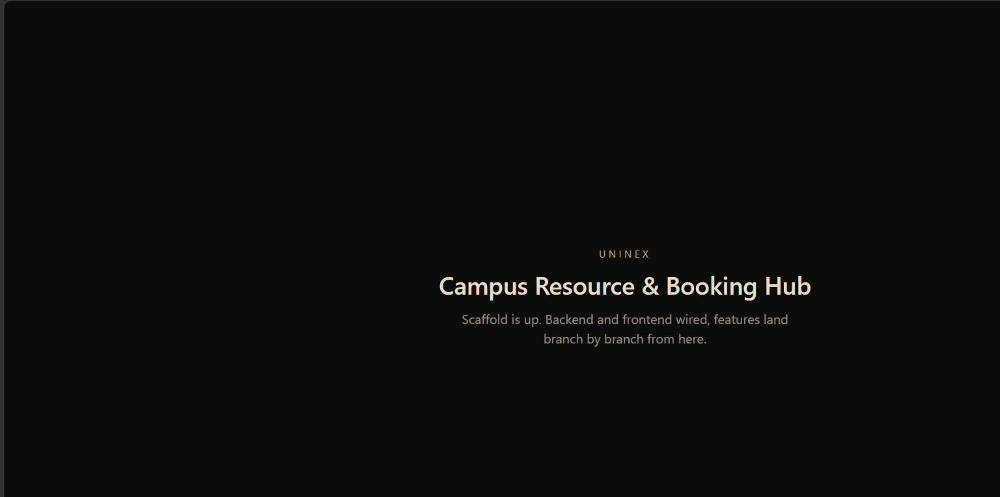

# Uninex Campus Hub


Smart campus resource management and booking system — solo build, own
implementation from scratch. Same problem space as a typical university
resource-booking system (seat/hall booking, admin approval, incident
tracking), built end-to-end by one person, feature by feature, through
real GitHub issues, branches and pull requests.

## Screenshot

<p align="center">
  
</p>

*Early scaffold — frontend and backend wired together. Screens for each
feature land as their branch merges.*

## Stack

- **Backend:** Spring Boot 3.5.16 (Java 21), Spring Data MongoDB, Spring Security, OAuth2 Client
- **Frontend:** React 19 + TypeScript, Vite, Tailwind CSS 4
- **Database:** MongoDB (embedded MongoDB for tests, Docker Compose for local dev)
- **Testing:** JUnit 5, Mockito, Spring `@DataMongoTest` / `@SpringBootTest` — see [`docs/TESTING.md`](docs/TESTING.md)

## Feature roadmap

Each row is a real GitHub issue, built on its own branch and merged through
its own pull request.

| # | Feature | Status |
|---|---|---|
| [#1](https://github.com/nilushamadhuwanthi123/uninex-campus-hub/issues/1) | Resource & seat management (admin CRUD) | ✅ Done |
| [#2](https://github.com/nilushamadhuwanthi123/uninex-campus-hub/issues/2) | Booking system: time slots + full-hall reservation | ✅ Done |
| [#3](https://github.com/nilushamadhuwanthi123/uninex-campus-hub/issues/3) | Admin approval workflow + QR ticket generation | ✅ Done |
| [#4](https://github.com/nilushamadhuwanthi123/uninex-campus-hub/issues/4) | Incident ticket system with technician assignment | ✅ Done |
| [#5](https://github.com/nilushamadhuwanthi123/uninex-campus-hub/issues/5) | Google OAuth2 login + role-based access | ✅ Done |
| [#6](https://github.com/nilushamadhuwanthi123/uninex-campus-hub/issues/6) | Review, rating and feedback system | ✅ Done |
| [#7](https://github.com/nilushamadhuwanthi123/uninex-campus-hub/issues/7) | Analytics dashboard for usage insights | ✅ Done |
| [#8](https://github.com/nilushamadhuwanthi123/uninex-campus-hub/issues/8) | Real-time notifications | ⏳ Planned |

## API (so far)

`Resource` = a bookable campus asset (hall, lab, room, or equipment), with
optional per-seat configuration.

| Method | Endpoint | Description |
|---|---|---|
| `GET` | `/api/resources` | List all resources |
| `GET` | `/api/resources/{id}` | Get one resource |
| `POST` | `/api/resources` | Create a resource (`201`) |
| `PUT` | `/api/resources/{id}` | Update a resource |
| `DELETE` | `/api/resources/{id}` | Delete a resource (`204`) |

`Booking` = a reservation of a resource (or specific seats on it) for a
time window. Overlapping bookings on the same resource and seats are
rejected with `409 Conflict`.

| Method | Endpoint | Description |
|---|---|---|
| `GET` | `/api/bookings` | List all bookings (optional `?resourceId=`) |
| `GET` | `/api/bookings/{id}` | Get one booking |
| `POST` | `/api/bookings` | Create a booking (`201`, `409` on conflict) |
| `POST` | `/api/bookings/{id}/cancel` | Cancel a booking |
| `POST` | `/api/bookings/{id}/approve` | Admin: approve + generate a QR ticket |
| `POST` | `/api/bookings/{id}/reject` | Admin: reject a booking |

`Incident` = a maintenance/fault report against a resource, with severity
and a lifecycle from report to resolution.

| Method | Endpoint | Description |
|---|---|---|
| `GET` | `/api/incidents` | List all incidents (optional `?resourceId=` or `?status=`) |
| `GET` | `/api/incidents/{id}` | Get one incident |
| `POST` | `/api/incidents` | Report an incident (`201`) |
| `POST` | `/api/incidents/{id}/assign` | Assign a technician (body: `{"technicianName": "..."}`) |
| `POST` | `/api/incidents/{id}/start` | Mark work in progress (`409` if unassigned) |
| `POST` | `/api/incidents/{id}/resolve` | Mark resolved |
| `POST` | `/api/incidents/{id}/close` | Close the ticket |

`Review` = a rating (1-5) and optional comment left against a resource.
The average rating is computed on every read from the real reviews, never
stored, so it can't drift out of sync.

| Method | Endpoint | Description |
|---|---|---|
| `GET` | `/api/reviews` | List all reviews (optional `?resourceId=`) |
| `GET` | `/api/reviews/{id}` | Get one review |
| `GET` | `/api/reviews/summary?resourceId=` | Average rating + review count for a resource |
| `POST` | `/api/reviews` | Leave a review (`201`) |
| `DELETE` | `/api/reviews/{id}` | Remove a review (moderation, STAFF/ADMIN only) |

`Analytics` = a usage-insights summary computed live from real bookings,
incidents and reviews (staff/admin only).

| Method | Endpoint | Description |
|---|---|---|
| `GET` | `/api/analytics/summary` | Booking/incident counts by status, average incident resolution time, overall average rating (STAFF/ADMIN only) |

`Auth` = the currently logged-in user's own identity, via Google OAuth2
login. Every user starts as `STUDENT` on first login; `STAFF`/`ADMIN` is
granted manually in the database — there is no self-service promotion.

| Method | Endpoint | Description |
|---|---|---|
| `GET` | `/api/auth/me` | Current logged-in user's email, name and role (`401` if not logged in) |

Endpoints that change data (create/update/delete a resource, approve or
reject a booking, assign/resolve an incident) require a logged-in user;
staff-only actions require the `STAFF` or `ADMIN` role. All role checks
happen server-side on every request — nothing about who can do what is
decided by the frontend.

### Auth setup

Real Google login needs your own OAuth2 credentials from
[Google Cloud Console](https://console.cloud.google.com/apis/credentials)
(OAuth consent screen + a Web application client). Set them as environment
variables before starting the backend — they are never committed:

```
set GOOGLE_CLIENT_ID=your-client-id
set GOOGLE_CLIENT_SECRET=your-client-secret
```

Without these set, the app still starts and all non-auth features work —
`GOOGLE_CLIENT_ID`/`GOOGLE_CLIENT_SECRET` fall back to harmless demo values
that let Spring Security boot, but real Google login will not succeed
until real credentials are provided.

## Running locally

Backend:
```
cd backend
./mvnw.cmd spring-boot:run
```

Frontend:
```
cd frontend
npm install
npm run dev
```

MongoDB: `docker compose up -d` (or point `spring.data.mongodb.uri` in
`backend/src/main/resources/application.properties` at any local MongoDB
instance).

## Testing

```
cd backend
./mvnw test
```

33/33 tests passing as of the latest run — unit tests for the service layer
(including the Google login → role mapping logic) plus real database-backed
integration tests (embedded MongoDB, no external setup needed). Full
breakdown, coverage, and known gaps are tracked honestly in
[`docs/TESTING.md`](docs/TESTING.md).

## Workflow

- `main` is protected — no direct pushes, everything lands through a pull
  request.
- Each feature above gets its own branch off `main` and its own PR, closing
  its tracking issue.
- Commits are kept small and scoped (one logical change per commit) so the
  history reads as real, incremental progress rather than one large dump.
